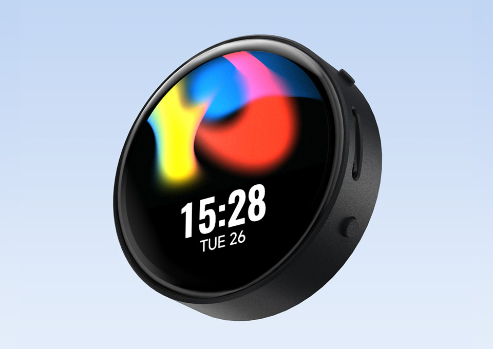

  <h1>ESP32-S3-Touch-AMOLED-1.75</h1>
  
<strong>ESP32-S3 development board with a 1.75-inch 466 × 466 QSPI AMOLED touch display</strong>

  

    
    
    
  

  

    <a href="README_ZH.md">简体中文</a> ·
    <a href="https://www.waveshare.com/product/esp32-s3-touch-amoled-1.75.htm">Product Page</a> ·
    <a href="https://docs.waveshare.com/ESP32-S3-Touch-AMOLED-1.75">Product Documentation</a> ·
    <a href="https://github.com/waveshareteam/ESP32-S3-Touch-AMOLED-1.75/releases/latest">Firmware Releases</a> ·
    <a href="docs/getting-started.md">Getting Started</a> ·
    <a href="examples/esp-idf/">ESP-IDF</a> ·
    <a href="examples/arduino/">Arduino</a>
  

  

---

## Overview

This repository provides example software, reproducible release firmware, the source-maintained
Brookesia application firmware, a complete factory recovery image, schematics, and bilingual user
documentation for the Waveshare ESP32-S3-Touch-AMOLED-1.75.

The board combines an ESP32-S3R8 with a high-resolution round AMOLED display, two-point capacitive
touch, motion sensing, power and battery management, a real-time clock, dual-microphone audio,
speaker output, and microSD storage in a compact platform.

### Product variants

| SKU | Product name |
| --- | --- |
| `31261` | ESP32-S3-Touch-AMOLED-1.75, standard board |
| `31262` | ESP32-S3-Touch-AMOLED-1.75-B, enclosure version |
| `31264` | ESP32-S3-Touch-AMOLED-1.75-G, LC76G GNSS version |

Check the official product page for the contents and options supplied with each variant. Examples
that require GNSS do not apply to the standard or `-B` variant.

## Hardware Overview

| Feature | Device / interface |
| --- | --- |
| MCU | ESP32-S3R8, dual-core Xtensa LX7 up to 240 MHz |
| Memory | 8 MB PSRAM and 16 MB external flash |
| Wireless | 2.4 GHz Wi-Fi 802.11 b/g/n and Bluetooth 5 LE |
| Display | 1.75-inch CO5300 QSPI AMOLED, 466 × 466, 16.7M colors |
| Touch | CST9217 I2C capacitive touch controller with two-point support |
| Power management | AXP2101 PMIC, 3.7 V battery connector, charging and battery telemetry |
| Motion sensor | QMI8658 six-axis IMU |
| Real-time clock | PCF85063 RTC with backup supply through the power subsystem |
| Audio input | ES7210 with two onboard microphones |
| Audio output | ES8311 codec, amplified speaker path, and MX1.25 speaker connector |
| Storage | microSD card slot using 1-bit SDMMC |
| USB and controls | USB-C native USB, PWR and BOOT buttons |
| Expansion | 8-pin 2.54 mm header with power, UART0, and GPIO16/GPIO17/GPIO18 |
| Board support | Managed component: [`waveshare/esp32_s3_touch_amoled_1_75`](https://components.espressif.com/components/waveshare/esp32_s3_touch_amoled_1_75) |
| Hardware files | [Hardware Reference](HARDWARE_REFERENCE.md), [schematics](Schematic/), and [official documentation](https://docs.waveshare.com/ESP32-S3-Touch-AMOLED-1.75) |

See [Hardware Reference](HARDWARE_REFERENCE.md) for the GPIO map, I2C addresses, audio and SD buses,
expansion header, and shared-resource notes.

## Firmware Quick Start

Choose the firmware form that matches the task:

| Firmware form | Intended use | Location |
| --- | --- | --- |
| CI release package | Reproducible test of one ESP-IDF or Arduino example | [GitHub Releases](https://github.com/waveshareteam/ESP32-S3-Touch-AMOLED-1.75/releases/latest) |
| Factory recovery image | Restore the complete customer demonstration at offset `0x0` | [`firmware/ESP32-S3-Touch-AMOLED-1.75-FactoryOnly-260805.bin`](firmware/ESP32-S3-Touch-AMOLED-1.75-FactoryOnly-260805.bin) |
| Brookesia source | Maintain or rebuild the application suite with ESP-IDF v5.5.4 | [`firmware/brookesia/README.md`](firmware/brookesia/README.md) |
| SD media package | Validate MusicPlayer, Gallery, VideoPlayer, and Recorder | [`firmware/SD-Card-Media-260805.zip`](firmware/SD-Card-Media-260805.zip) |

### Flash a release example

1. Download the required `*-combined.zip` from the latest release.
2. Extract the archive and install esptool with `python -m pip install esptool`.
3. Connect the board with a USB data cable.
4. Run `flash_combined.bat COMx` on Windows or `./flash_combined.sh /dev/ttyACM0` on Linux.
5. Reset the board if it does not restart automatically.

> [!NOTE]
> The combined image is written at offset `0x0`. Each archive also contains the original
> offset-addressed binaries, helper scripts, command files, a manifest, and checksums.

Do not mix a release example, the factory image, or split binaries from different packages. The
factory image has its own verified command and checksum in the bilingual
[Firmware Delivery Guide](firmware/README.md). A normal update does not require erasing flash.

## Brookesia Application Firmware

The source-maintained factory application provides twelve round-screen applications:

- SquareLine, Calculator, DrawPanel, and Crosshair.
- SpecAnalyzer and Recorder using the ES7210 dual-microphone input.
- MusicPlayer, Gallery, and VideoPlayer using the microSD card.
- Settings with live AXP2101 battery information, native Wi-Fi state, storage diagnostics, and safe eject.
- AIChats with optional text-history storage and Gravitysphere driven by the QMI8658 IMU.

The status bar follows live battery and Wi-Fi state. The media applications, generated fixture
formats, FFmpeg commands, privacy notes, and SD-card layout are documented in the bilingual
[Media Production Guide](firmware/MEDIA_GUIDE.md).

## Examples

### ESP-IDF

| Example | Focus |
| --- | --- |
| [01_AXP2101](examples/esp-idf/01_AXP2101/) | Power management, charging, and battery telemetry |
| [02_lvgl_demo_v9](examples/esp-idf/02_lvgl_demo_v9/) | LVGL 9 display benchmark |
| [03_esp-brookesia](examples/esp-idf/03_esp-brookesia/) | ESP-Brookesia phone-style application UI |
| [04_Immersive_block](examples/esp-idf/04_Immersive_block/) | Motion-controlled falling-block demo |
| [05_Spec_Analyzer](examples/esp-idf/05_Spec_Analyzer/) | Microphone FFT spectrum analyzer |

### Arduino

| Example | Focus |
| --- | --- |
| [01_HelloWorld](examples/arduino/01_HelloWorld/) | Display bring-up and text output |
| [02_GFX_AsciiTable](examples/arduino/02_GFX_AsciiTable/) | GFX text and character rendering |
| [03_LVGL_PCF85063_simpleTime](examples/arduino/03_LVGL_PCF85063_simpleTime/) | LVGL real-time clock interface |
| [04_LVGL_QMI8658_ui](examples/arduino/04_LVGL_QMI8658_ui/) | LVGL accelerometer and gyroscope interface |
| [05_LVGL_AXP2101_ADC_Data](examples/arduino/05_LVGL_AXP2101_ADC_Data/) | LVGL power and battery telemetry |
| [06_LVGL_Widgets](examples/arduino/06_LVGL_Widgets/) | LVGL music UI, touch input, and IMU integration |
| [07_LVGL_SD_Test](examples/arduino/07_LVGL_SD_Test/) | microSD access through an LVGL application |
| [08_ES8311](examples/arduino/08_ES8311/) | ES8311 audio output and LVGL interface |
| [09_LC76G_I2C](examples/arduino/09_LC76G_I2C/) | LC76G GNSS over I2C on compatible hardware |
| [10_Touch_CST9217](examples/arduino/10_Touch_CST9217/) | Raw interrupt-driven single- and two-point touch diagnostics |

Bundled Arduino libraries live under [`examples/arduino/libraries`](examples/arduino/libraries/).
Their upstream samples are dependencies, not first-party product firmware targets. See the complete
[Example Catalog](docs/examples.md).

## Supported Toolchains

| Surface | Validated version | Projects | Firmware builds |
| --- | --- | ---: | ---: |
| ESP-IDF examples | `v5.5.4` | 5 | 5 |
| ESP-IDF examples | `v6.0.2` | 5 | 5 |
| Arduino-ESP32 examples | `3.3.10` | 10 | 10 |
| Brookesia source firmware | ESP-IDF `v5.5.4` | 1 | Built outside the example matrix |

The [Build Examples workflow](https://github.com/waveshareteam/ESP32-S3-Touch-AMOLED-1.75/actions/workflows/examples.yml)
runs two discovery jobs and 20 build/package jobs for the current source tree. The historical v1.0.1
release predates `10_Touch_CST9217` and contains 19 firmware packages. See
[Continuous Integration](docs/ci.md) for the matrix and release gate.

## Repository Layout

| Path | Purpose |
| --- | --- |
| [`README_ZH.md`](README_ZH.md) | Complete Simplified Chinese repository guide |
| [`HARDWARE_REFERENCE.md`](HARDWARE_REFERENCE.md) / [`HARDWARE_REFERENCE_ZH.md`](HARDWARE_REFERENCE_ZH.md) | Bilingual board-level hardware reference |
| [`assets/`](assets/) | Official product imagery used by the documentation |
| [`examples/esp-idf/`](examples/esp-idf/) | First-party ESP-IDF projects |
| [`examples/arduino/`](examples/arduino/) | First-party Arduino sketches and bundled libraries |
| [`firmware/`](firmware/) | Brookesia source, factory recovery image, SD media, and bilingual delivery guides |
| [`releases/`](releases/) | Packaging, artifact download, and release tools |
| [`config/`](config/) | Shared ESP-IDF compatibility overlays |
| [`docs/`](docs/) | Setup, examples, CI, components, firmware, and troubleshooting guides |
| [`Schematic/`](Schematic/) | Public schematic files |
| [`scripts/`](scripts/) | CI example-discovery helpers |
| [`.github/`](.github/) | GitHub Actions and public collaboration templates |

## Documentation

- [Documentation Index / 文档中心](docs/README.md)
- [Getting Started](docs/getting-started.md) / [快速开始](docs/getting-started_ZH.md)
- [Hardware Reference](HARDWARE_REFERENCE.md) / [硬件参考](HARDWARE_REFERENCE_ZH.md)
- [Example Catalog](docs/examples.md) / [示例目录](docs/examples_ZH.md)
- [Troubleshooting](docs/troubleshooting.md) / [故障排查](docs/troubleshooting_ZH.md)
- [Firmware and Factory Recovery / 固件与工厂恢复](docs/firmware.md)
- [Firmware Delivery Guide / 固件交付说明](firmware/README.md)
- [Media Production Guide / 素材制作指南](firmware/MEDIA_GUIDE.md)
- [Brookesia Source Firmware](firmware/brookesia/README.md) / [Brookesia 源码固件](firmware/brookesia/README_ZH.md)
- [Repository Structure](docs/repository-structure.md) / [仓库结构](docs/repository-structure_ZH.md)
- [Continuous Integration](docs/ci.md) / [持续集成](docs/ci_ZH.md)
- [Components](docs/components.md) / [组件说明](docs/components_ZH.md)
- [Release Tools](releases/README.md) / [发布工具](releases/README_ZH.md)
- [Changelog](CHANGELOG.md) / [变更记录](CHANGELOG_ZH.md)
- [Official Product Documentation](https://docs.waveshare.com/ESP32-S3-Touch-AMOLED-1.75)
- [Official Resources](https://docs.waveshare.com/ESP32-S3-Touch-AMOLED-1.75/Resources-And-Documents)
- [Official FAQ](https://docs.waveshare.com/ESP32-S3-Touch-AMOLED-1.75/FAQ)
- [Official Technical Support](https://docs.waveshare.com/ESP32-S3-Touch-AMOLED-1.75/Technical-Support)

## Support and Contributions

Contributions and reproducible issue reports are welcome. Include the board variant, example path,
framework version, reproduction steps, expected and actual behavior, and the smallest relevant log
excerpt. Remove Wi-Fi credentials, tokens, conversation content, local paths, serial numbers, MAC
addresses, and other private or customer-specific data before publishing logs or screenshots.

- [Contributing Guide](CONTRIBUTING.md) / [贡献指南](CONTRIBUTING_ZH.md)
- [Support](SUPPORT.md) / [技术支持](SUPPORT_ZH.md)
- [Security Policy](SECURITY.md) / [安全策略](SECURITY_ZH.md)
- [Open an Issue](https://github.com/waveshareteam/ESP32-S3-Touch-AMOLED-1.75/issues/new/choose)

## License

This repository is licensed under the Apache License 2.0. See [LICENSE](LICENSE).
